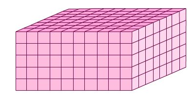

## Quiz
The quiz widget allows a user to create interactive quizzes.  Q&A options include:

1. Radio

2. Checkbox

3. Multi Text

4. Submit Compare

--- &radio

What is 1 + 1?

1. 1
2. _2_
3. 3
4. 4

*** .hint

Not 1, 3, or 4

*** .explanation

Come on people, it's 1 + 1

---  &radio
What is the volume of this rectangular prism? 

image: 

1.  800 cubic units
2.  _400 cubic units_
3.  100 cubic units
4.  80 cubic units

*** .hint

Volume of a rectangle = length X width X height.

--- &checkbox

Solve the following equation for X:

2X - 10 = 8 - X

1. _6_
2. 22
3. Banana

*** .hint

It's not Banana

*** .explanation

Add X to both sides of the equation.  Add 10 to both sides of the equation.  The equation becomes 3X = 18.  Dive both sides by 3.  X then equals 6.

--- &multitext .codefont .outfont .codemargin .outmargin

Harry Potter and the Sorcerer's Stone - 152 minutes       

Harry Potter and the Chamber of Secrets - 161 minutes

Harry Potter and the Prisoner of Azkaban - 142 minutes 

Harry Potter and the Goblet of Fire - 157 minutes

Harry Potter and the Order of the Phoenix - 138 minutes 

Harry Potter and   the Half-Blood Prince - 153 minutes

Harry Potter and the Deathly Hallows: Part 1 - 146 minutes  

Harry Potter and the Deathly Hallows: Part 2 - 130 minutes

1. What is the average (mean) length of a Harry Potter movie?

2. What is the median length of a Harry Potter movie?

3. What is the range of the Harry Potter movie lengths? (answer is two numbers separated by a space)

*** .explanation

1. 152
2. 149
3. 130 161

*** .hint
Mean = sum of all observations divided by the number of observations.  To calculate the median, put the numbers in order, and find the one in the middle.  If there are two middle numbers, average them.  The range is the smallest and the largest numbers.

--- 
Let me know if you want help building quizzes like this!

